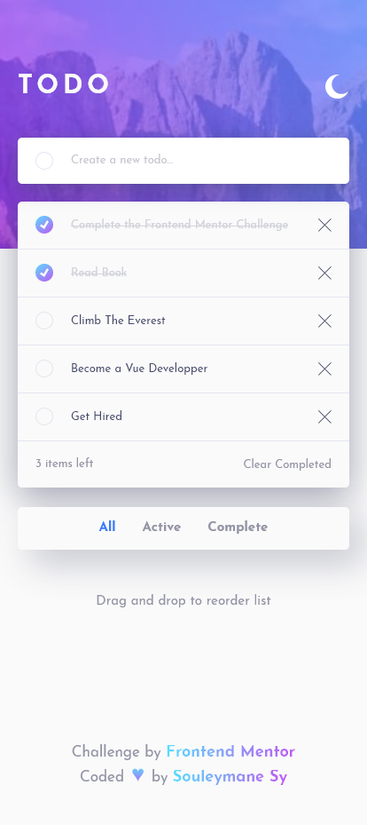
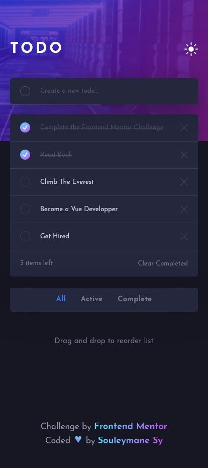
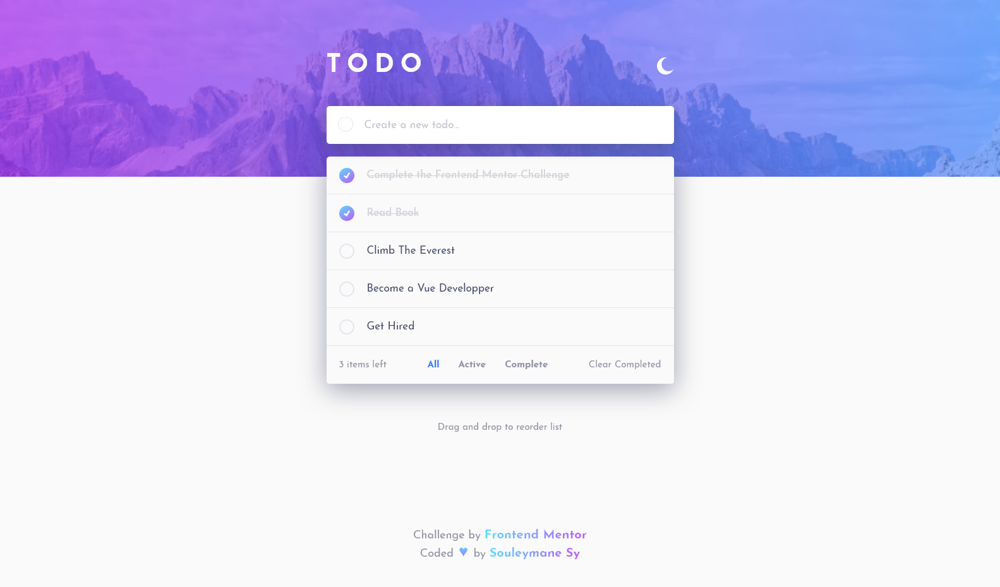

# Frontend Mentor - Todo app

## Welcome! 👋

Thanks for checking out this front-end coding challenge.

This is a solution to the [Todo app challenge on Frontend Mentor](https://www.frontendmentor.io/challenges/todo-app-Su1_KokOW). Frontend Mentor challenges help you improve your coding skills by building realistic projects.

[Frontend Mentor](https://www.frontendmentor.io) challenges help you improve your coding skills by building realistic projects.

## The challenge

The challenge is to build out this todo app and get it looking as close to the design as possible.

Users should be able to:

- View the optimal layout for the app depending on their device's screen size
- See hover states for all interactive elements on the page
- Add new todos to the list
- Mark todos as complete
- Delete todos from the list
- Filter by all/active/complete todos
- Clear all completed todos
- Toggle light and dark mode
- **Bonus**: Drag and drop to reorder items on the list

### Screenshot

This is the Screenshot of the projects a made!

### Mobile Light Theme

### Mobile Dark Theme

### Desktops Light Theme

### Desktops Dark Theme

### Links

- Solution URL: [solution URL here](https://www.frontendmentor.io/solutions/todo-list-app-made-with-vue-js-fNjKGoDxDh)
- Live Site URL: [live site URL here](https://fem-todo-app-ten.vercel.app/)

## My process

Made this projects with Vue JS Framework.

### Built with

- Semantic HTML5 markup
- SASS
- CSS custom properties
- Flexbox
- CSS Grid
- Mobile-first workflow
- [Vue Js](https://vuejs.org/) - JS Framework

## Author

- GitHub - [Souleymane Sy](https://github.com/SouleymaneSy7)
- Frontend Mentor - [@SouleymaneSy7](https://www.frontendmentor.io/profile/SouleymaneSy7)
- Twitter - [@Souleymanesy43](https://twitter.com/Souleymanesy43)
